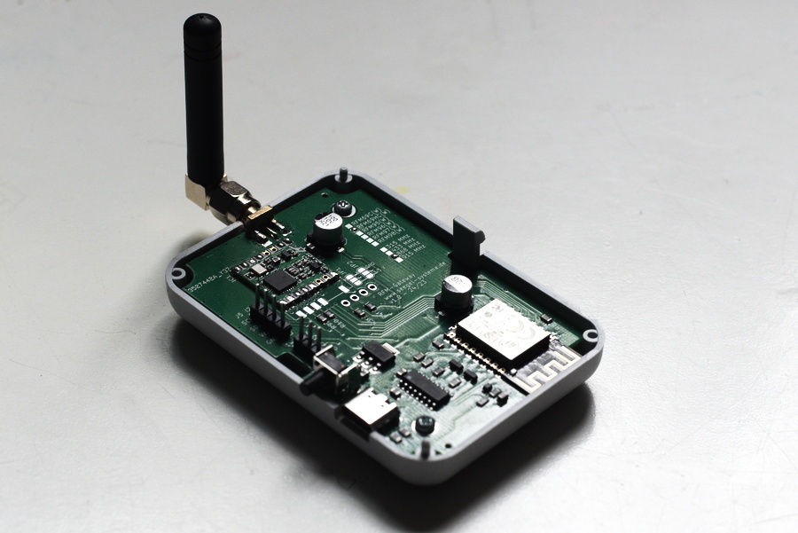

  
  
  
  

# RFM Gateway

RFM Gateway is a radio-to-WiFi bridge that connects HopeRF radio modules to an
ESP8266. It can receive RF data and forward it to your WiFi network, and it can
also send RF commands from HTTP or MQTT inputs.

Project description:
https://www.seegel-systeme.de/2023/09/15/rfm-wifi-gateway-a-radio-to-wifi-bridge/

Home Assistant forum:
https://community.home-assistant.io/t/rfm-gateway-a-sub-ghz-bridge-to-home-assistant/982886

## Highlights

- USB-C for power, flashing, and UART access
- Integrated USB programmer (no extra external programmer required)
- SMA antenna connector for the radio module
- Optional 0.96 inch I2C OLED support
- I2C and 1-wire extension headers

## Firmware capabilities

- 433 MHz RC pulse gateway (receive and transmit)
- 868 MHz sensor gateway (for supported sensor families)
- 868 MHz FS20 gateway
- Home Assistant integration via MQTT discovery

## Typical applications

- Bring wireless weather sensors into WiFi and MQTT
- Control RF sockets and remote controls
- Bridge RF nodes into home automation systems

## Repository structure

- [Firmware/](Firmware/): PlatformIO firmware project and web UI
- [PCB/](PCB/): hardware design files
- [assets/](assets/): screenshots and images

### Preview

